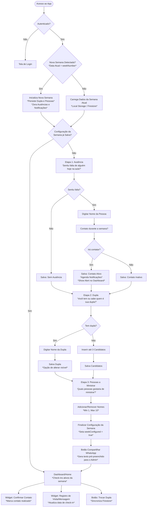

# Arquitetura e Fluxo da Seção de Ministração (PWA & Firebase)

Este documento descreve a especificação técnica e de experiência do usuário para o fluxo da seção **Ministração**, garantindo a consistência multidispositivo, funcionamento offline resiliente e ciclos semanais definidos.

---

## 1. Diagrama de Fluxo Completo e Transições

O diagrama abaixo ilustra todos os caminhos do fluxo semanal da seção de Ministração:



### Documentação de Transições de Tela

1. **Acesso ao App → Login / Dashboard**:
   - *Condição:* Verifica se há um usuário ativo em cache local ou no Firebase Auth.
   - *Ação:* Se não autenticado, vai para `/login`. Se autenticado, verifica se a configuração da semana atual foi concluída (`weekConfigured = true`). Se concluída, vai para `/home`. Caso contrário, vai para o fluxo da Etapa 1 em `/ministrar`.

2. **Etapa 1: Ausência (Falta na Aula)**:
   - *Descrição:* Pergunta ao usuário: *"Você sentiu a falta de alguém hoje na Aula?"*.
   - *Caminho A (Não):* Salva `absence.asked = true` e avança para a Etapa 2.
   - *Caminho B (Sim):* Abre o campo de texto para digitar o nome do ausente. Em seguida, pergunta: *"Contato durante a semana?"*. Se sim, agenda o lembrete de notificações locais.

3. **Etapa 2: Dupla de Ministração**:
   - *Descrição:* Pergunta se o usuário sabe quem é sua dupla.
   - *Caminho A (Sim):* Salva o nome da dupla. Fornece o botão "Trocar Dupla" posteriormente no Dashboard para fins de edição.
   - *Caminho B (Não):* Exibe até 3 campos para inserção de possíveis candidatos a dupla de ministração para cruzamento de dados.

4. **Etapa 3: Pessoas a Ministrar**:
   - *Descrição:* Permite gerenciar a lista de nomes sob a responsabilidade do usuário.
   - *Ação:* O usuário pode adicionar novos nomes ou remover nomes já cadastrados. Após salvar, o app gera o link/botão para enviar as informações compiladas ao administrador do ministério via WhatsApp.

---

## 2. Matriz de Validações do Formulário

| Etapa | Campo / Ação | Regra de Validação | Mensagem de Erro / Feedback | Impacto no Fluxo |
| :--- | :--- | :--- | :--- | :--- |
| **1. Ausência** | Nome do ausente | Obrigatório se a resposta for "SIM". Mínimo 3 caracteres. | "Por favor, insira o nome completo da pessoa que faltou." | Impede o avanço para a pergunta de contato. |
| **1. Ausência** | Nome do ausente | Evitar duplicados na lista de ministração ativa do usuário. | "Esta pessoa já consta na sua lista ativa de ministração." | Alerta visual, mas permite prosseguir se o usuário insistir. |
| **2. Dupla** | Nome da dupla | Obrigatório se "SIM". Mínimo 3 caracteres. Apenas letras. | "Digite o nome da sua dupla (mínimo 3 caracteres)." | Impede a conclusão da etapa. |
| **2. Dupla** | Candidatos | Se "NÃO", permite de 1 a 3 nomes. Nenhum pode estar vazio. | "Por favor, preencha pelo menos 1 candidato a dupla ou altere sua resposta." | Impede a conclusão da etapa. |
| **2. Dupla** | Candidatos | Nomes idênticos (duplicações) são rejeitados. | "O nome '{nome}' já foi inserido como candidato." | Limpa o campo duplicado automaticamente. |
| **3. Pessoas** | Lista de Nomes | Mínimo de 1 nome e máximo de 10 nomes. | "Adicione pelo menos 1 pessoa para ministrar (limite de 10)." | Desabilita o botão de salvar/concluir. |
| **3. Pessoas** | Compartilhar | Número do Admin deve estar no formato internacional correto. | "Número do administrador não configurado. Por favor, copie o texto." | Habilita cópia para área de transferência se o link direto falhar. |

---

## 3. Schema do Firestore (`users/{userId}/ministration/{weekId}`)

Os dados semanais de ministração são salvos na subcoleção `users/{userId}/ministration/{weekId}`, em que `weekId` é uma string no formato de data ISO `YYYY-WW` (ex: `2026-28`).

```typescript
interface MinistrationDocument {
  weekId: string;        // Padrão "YYYY-WW" (ex: "2026-28")
  weekNumber: number;    // Número da semana (1-53)
  year: number;          // Ano de referência (ex: 2026)
  weekConfigured: boolean; // Controla se o fluxo inicial foi totalmente finalizado
  
  absence: {
    asked: boolean;
    confirmed: boolean;
    personName: string | null;
    timestamp: number | null; // Timestamp UNIX (ms)
  };
  
  contact: {
    willContact: boolean;
    confirmationTimestamp: number | null;
    contactCompleted: boolean;
    completedTimestamp: number | null;
  };
  
  ministry: {
    hasPartner: boolean;
    partnerName: string | null;
    partnerConfirmedAt: number | null;
    candidates: string[]; // Se hasPartner === false, guarda até 3 nomes
  };
  
  people: Array<{
    id: string; // UUID gerado no cliente
    name: string;
    addedAt: number;
    checkedInAt: number | null; // Última interação na semana
  }>;
  
  notifications: Array<{
    id: string;
    scheduledFor: number; // Timestamp UNIX de quando enviar
    sent: boolean;
    type: 'absence_follow_up' | 'people_follow_up';
  }>;
  
  updatedAt: number; // Controle de concorrência Last-Write-Wins (LWW)
}
```

---

## 4. Estratégia de Sincronização e Camadas de Dados

```
  ┌──────────────────────────────────────────────────────────────┐
  │                        LOCAL STORAGE                         │
  │  - Cache offline de todo o estado da semana atual            │
  │  - Rascunhos temporários do formulário de fluxo ativo        │
  └──────────────────────────────┬───────────────────────────────┘
                                 │ ▲ (onSnapshot syncs updates)
                                 │ │ (Conflict resolution via updatedAt)
                                 ▼ │
  ┌──────────────────────────────────────────────────────────────┐
  │                          FIRESTORE                           │
  │  - Dados definitivos por semana: users/{uid}/ministration/   │
  │  - Histórico persistente multidispositivo                     │
  └──────────────────────────────┬───────────────────────────────┘
                                 │
                                 ▼ (Sincronizado na nuvem)
  ┌──────────────────────────────────────────────────────────────┐
  │                  REALTIME DATABASE (RTDB)                    │
  │  - Presença em tempo real (sessions/{uid}/online)            │
  │  - Agendamentos rápidos de notificações push imediatas       │
  └──────────────────────────────────────────────────────────────┘
```

### Lógica de Resolução de Conflitos: Last-Write-Wins (LWW)
- **Modificação Online:** O cliente altera o Firestore. O listener local (`onSnapshot`) reflete a alteração no Local Storage.
- **Modificação Offline:** O cliente altera o Local Storage localmente e incrementa o `updatedAt`. Assim que restabelecer a conexão, envia a atualização ao Firestore. Se o Firestore tiver uma data posterior, ela é baixada e sobrescreve o Local Storage.

---

## 5. Lógica de Reset Semanal

O ciclo semanal de dados ocorre à **meia-noite de domingo para segunda-feira** (00:00:00 UTC-3).

### Comportamento de Reset por Dispositivo (Client-side)
1. Ao carregar o app, o sistema calcula o `weekId` correspondente à data atual (`YYYY-WW`).
2. Se o `weekId` atual for diferente do último documentado no cache local:
   - **Persistência Seletiva:** A lista de ministrações (`people`) e a dupla atual (`ministry.partnerName`) são copiadas para o novo documento da nova semana.
   - **Limpeza:** A ausência (`absence`), a confirmação de contato (`contact`) e a lista de notificações da semana passada são limpas.
   - **Redirecionamento:** `weekConfigured` é definido como `false`, forçando a reconfiguração semanal.

---

## 6. Lógica e Ciclos de Notificações

Se o usuário confirmou que fará o contato com a pessoa ausente na Etapa 1, os lembretes são ativados.

### Cronograma de Disparo
- **Notificação 1 (Dia +2 às 10h):** *"Olá! Como está indo o contato com {nome}? Lembre-se de mandar uma mensagem para saber se está tudo bem."*
- **Notificação 2 (Dia +4 às 10h):** *"Passando para lembrar da ministração. Já conseguiu falar com {nome}? Confirme no app!"*
- **Notificação 3 (Sábado às 14h):** *"Amanhã temos aula! Não se esqueça de registrar se o contato com {nome} foi realizado."*

### Desativação e Sincronização
- Ao marcar **"Contato realizado"** no Dashboard, o array de notificações da semana é marcado como `sent: true` ou removido.
- A sincronização multidispositivo garante que se o contato for marcado como realizado no Dispositivo A, as notificações agendadas serão canceladas no Dispositivo B via Firestore Sync.

---

## 7. Painel do Administrador (Dashboard Admin)

O administrador precisa acompanhar as respostas semanais do ministério para fins de suporte e tomada de decisões.

### Funcionalidades do Dashboard Admin
- **Preenchimento Semanal:** Lista quem já preencheu e quem está com pendência na semana de referência.
- **Visualizador de Duplas:** Exibe a dupla consolidada ou as sugestões de candidatos para match rápido de quem está sozinho.
- **Ações de Cobrança:** Envio automático de mensagens pré-formatadas para lembrar do preenchimento da semana.
- **Histórico Consolidado:** Gráficos simples indicando a evolução do número de ministrações concluídas ao longo dos meses.

---

## 8. Matriz de Edge Cases

| Cenário | Comportamento Esperado | Mecanismo de Implementação |
| :--- | :--- | :--- |
| **Usuário sai sem terminar o fluxo.** | O progresso de cada etapa é persistido localmente no Local Storage no evento `onChange`. | O `AuthGuard` ou `Layout` detecta se `weekConfigured` é `false` e, com base nos campos preenchidos no cache local, renderiza a etapa correspondente. |
| **Muda de dupla no meio da semana.** | A dupla atual é atualizada. O histórico da dupla anterior não é perdido (permanece nos dados das semanas anteriores). | O botão "Trocar Dupla" no Dashboard limpa `ministry.partnerName` e seta `hasPartner = false` no documento da semana atual, reabrindo a tela de configuração da Etapa 2 para o usuário atualizar. |
| **Dois dispositivos salvam ao mesmo tempo.** | A alteração com o maior timestamp `updatedAt` prevalece (LWW). | Regra de escrita direta com controle transacional simples no cliente. |
| **Usuário desmarca "Contato realizado".** | É permitido desfazer. As notificações agendadas não enviadas são recalculadas e re-agendadas. | Atualiza o Firestore com `contactCompleted = false` e chama a função de reagendamento de notificações. |
| **Lista de ausência e de ministrados duplicada.** | O sistema exibe um aviso visual informando que a pessoa já está na lista, mas permite prosseguir caso queira separar o contato emergencial da ministração contínua. | Validação simples por array-scan antes de salvar cada etapa. |

---

## 9. Checklist de Refinamento de Código (Prioridades)

Para as próximas fases de codificação do projeto, priorize o seguinte cronograma:

1. **`src/lib/date.ts`**: Criar utilitário de data para cálculo robusto de semana ISO e anos de referência.
2. **`src/app/ministrar/page.tsx`**: Criar a interface de etapas (Etapa 1: Ausência, Etapa 2: Dupla, Etapa 3: Ministrar).
3. **`public/sw.js`**: Integrar a API de Notificação local baseada em fila.
4. **Resiliência Offline**: Validar concorrência e o pipeline de resincronização via simulação em modo offline de rede do navegador.
